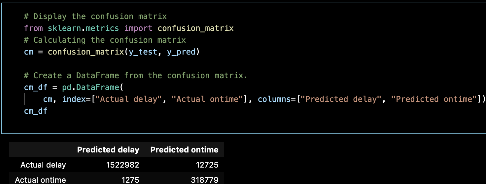

# Final_Project_Group_3

 # Airline Delay Prediction Model

## Overview
- Application run in browser to predict flight delays using machine learning and weather data API.

## Why
- Flight delay can be a waste of money and time. Predicting the probability of a weather delay is exciting and useful.

## Data Set
- We Chose a [Kaggle data set](https://www.kaggle.com/datasets/threnjen/2019-airline-delays-and-cancellations)
- The data set is sourced from the Bureau of Transportation Statistics, organized and has a preliminary Machine learning model. 

## Questions We Hope To Answer

- Perform an Exploratory Data Analysis on the data set. 
- Which carriers are most and least reliable for on-time departure? 
- Which airports are best and worst for on-time departures? 
- Which features in the data set are most correlated with a departure delay?
- Use the dataset to make predictions. Can you accurately predict a departure delay?
- Use the raw data files to re-tool the dataset and make our own prediction problem. Can we predict the reason for departure delay? Can we predict arrival delay?

## Software
- See technology.md

# Team Communication Protocols
## Branches
- Branches should be created using the following format: `<feature>_<initials>` (i.e `machine-learning-model_TL`).
- Each neww feature of the Application should have a resprective branch.
- [Helpful Wiki for creation and management of branches](https://github.com/Kunena/Kunena-Forum/wiki/Create-a-new-branch-with-git-and-manage-branches)

## Issues
- Each Application enhancements should have the following creation flow:
  - Create an Issue with the Enhancement Feature as the title (i.e. `Provisional Machine Learning Model`)
  - If the Issue falls within your project duties, assign the Issue to yourself. Otherwise, a team member will assign themselves open Issues that fit their project duties or skill set.  
  - If a new Issues is blocked by another issue, add the number of the Issue in the new Issue comments.  
  - Add the appropriate label to the Issue (i.e. `documentation`, `enhancement` etc.)
  - Here is a [Best Practices Guide to Github Issues](https://docs.github.com/en/issues/tracking-your-work-with-issues/quickstart)
  - Once you have assigned or been assigned an Issue, this should be communicated to the team in Slack for clarity (an @here may be used in time sensitive communication)

## Slack
- `Threads` should be used when discussing deliverables in general chat, to make it easy for members to follow projects asynchronously.
- `Pin` data sets, links or important post pertaining to the project in the team chat in order to expedite searches. 

## Zoom
- Calendar invites should include Zoom links and entry codes
- Free Zoom has a max time of 40 minutes, then force quits. If meeting time is exceeding, rejoin the meeting using the original link.
- Google free service could also be considered for meetings expected to be longer that 40 min.

 # Machine Learning Model
 
 ## Dependencies
 
 

 ## Logistic Regression to Predict Flight Arrival Delay

 `Logistic Regression is a statistical method for predicting binary outcomes from data.`

 - We will use this model to take the DEP_DEL15 dimension data and split flights it into classes.
 - The ArrDel15 dimension data is "0" for ontime departure and "1" for an arrival delay.
 - The dimension data is boolean confirming if the minute count in Arr_Delay_NEW is greater than 15 minutes. It is industry knowledge that flight are not counted as late unless the delay is > 15.
 
 ## Features used
 
 - The training model inlncludes the following features: 
   `Flight_Number_Marketing_Airline`,
    `Cancelled`,
    `Diverted`,
    `CRSDepTime`,
    `DepTime`,
    `DepDelayMinutes`,
    `OriginAirportID`,
    `DestAirportID`,
    `TaxiOut`,
    `TaxiIn`,
    `CRSArrTime`,
    `ArrDelay`, `ArrDel15`
## Algorithm  
 -  We can calculate logistic regression flight delay by adding an activation function as the final step to our linear model.
 - This converts the linear regression output to a probability.
 - We used `Oversampling` to see the accurtacy of arrival delays.
 
 ## Results 
 
 ### Naive Random Oversampling
 
 - We used the imblearn module to create a randomized data set to test the Algorith. 
 - The oversampling algorithm split the data set into `2,970,512` delayed and ontime flight.
 - `Counter({0.0: 2970512, 1.0: 2970512})`
 
 ### Accuracy score
 
 - The sample produced an acuracy scroe of `0.993522669243076`
 - We can see from the confusion matrix that the `true positive` and `true negative` rate reflect the accuracy score.
 
 
 ### Feature importance
 
 - We found that the feature `CRSDepTime` ranked highest among the 13 training features at `49%`
 - The feature data is the scheduled departure time, stored as int64.
 
 
 
 
 - [Click here for an amazing looking dashboard that demonstrates what we learned from our analysis!](https://public.tableau.com/app/profile/matthew.hand2472/viz/ArrivalDelayDashboards/Dashboard1?publish=yes)

 
 # Questions
 - What type of Logistical regression algorithms will offer the best prediction of flight departure delay?
 - Can we make a prediction of planes that could need service based on CARRIER_DELAY and unique values in TAIL_NUM?
